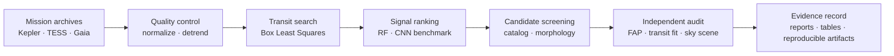

# SXS | Kepler Transit Intelligence Pipeline

[](LICENSE)
[](pyproject.toml)
[](https://github.com/Science-Experimental-Technologies/Exoplanet-Search/actions/workflows/ci.yml)
[](DISCLAIMER.md)

SXS — SCIX Exoplanet Search is a computational astronomy system for recovering, ranking, and independently auditing transit-like signals in public Kepler photometry. It combines Box Least Squares detection, target-grouped machine learning, catalog screening, empirical false-alarm analysis, physical transit fitting, and external evidence from Gaia and TESS.

The software was created by [Rasya Andrean](https://www.rasyaandrean.my.id/) under [Science Experimental Technologies](https://github.com/Science-Experimental-Technologies). Development was independently funded by [Rasya Andrean](https://github.com/RasyaAndrean) and [Urus Foundation](https://github.com/Urus-Foundation).

> SXS does not claim the discovery, validation, or confirmation of a new exoplanet. Its candidate outputs require independent scientific confirmation.

## Research record

| Evaluation | Result | Meaning |
|---|---:|---|
| Baseline BLS top-five recovery | 15/36 (41.67%) | Confirmed planets recovered inside the fixed search domain |
| Baseline RF end-to-end recovery | 12/36 (33.33%) | Confirmed planets retained after detection and ranking |
| Scaled BLS top-five recovery | 227/434 (52.30%) | Recovery across the quality-filtered confirmed-planet benchmark |
| RF v2 precision / recall | 0.412 / 0.903 | Target-grouped out-of-fold performance at threshold 0.221107 |
| RF v2 false-positive rate | 0.146 | 292 false passes among 2,000 negative peaks |
| Bounded search | 250 targets; 1,250 peaks | Deterministically selected workstation-scale sample |
| Independent review | 0 strong; 1 weak; 19 likely false positives | Final classification of the frozen 20-signal queue |

The only weak signal is `KIC 8300900-r1`, with a period of 5.090289 days and empirical BLS false-alarm probability `20/1,001 = 0.01998`. It has no supporting TESS period match and is not a confirmed exoplanet.

## System design



The workflow separates **ranking** from **scientific validation**. Machine-learning scores prioritize signals for review; they are never interpreted as planetary probabilities. Independent review does not reuse model probabilities in its decision rules.

Core capabilities include:

- reproducible Kepler and TESS acquisition through public archive services;
- segment-aware normalization and Savitzky–Golay detrending;
- blind 0.5–50 day BLS searches with distinct-peak selection;
- Random Forest and compact 1D CNN evaluation with `StratifiedGroupKFold`;
- deterministic unknown-target sampling with catalog-history exclusion;
- empirical segment-shuffle false-alarm testing over the full BLS grid;
- odd/even, secondary-eclipse, transit-shape, physical-size, Gaia, TESS, and TOI checks; and
- machine-readable provenance, fixed configurations, and deterministic tests.

## Quick start

SXS supports Python 3.11 and 3.12. Windows received the complete workstation validation; hosted CI verifies the deterministic core on Ubuntu.

```powershell
git clone https://github.com/Science-Experimental-Technologies/Exoplanet-Search.git
cd Exoplanet-Search
py -3.11 -m venv .venv
.\.venv\Scripts\Activate.ps1
python -m pip install --upgrade pip
python -m pip install -r requirements.txt
```

On Linux or macOS, activate the environment with `source .venv/bin/activate`.

Choose the dependency set that matches the work:

- `requirements-core.txt` — acquisition, preprocessing, BLS, validation, and deterministic CI;
- `requirements.txt` — complete scientific and machine-learning environment;
- `requirements-ml.txt` — compatibility alias for the complete environment; and
- `requirements-docs.txt` — manuscript and PDF build support.

## Command interface

The unified command interface presents the system by responsibility rather than by development milestone:

```powershell
# Inspect the baseline workflow without writing artifacts
python -m src.cli baseline --config configs/base.yaml --dry-run

# Reproduce the scaled training and model qualification
python -m src.cli scaleup --config configs/scaleup.yaml --resume

# Run the bounded candidate screen
python -m src.cli search --config configs/candidate_search.yaml --resume

# Run the independent evidence audit
python -m src.cli validate --config configs/independent_validation.yaml --stage all
```

These operations can download public mission products and execute expensive period searches. Review the selected configuration and available storage before a full run.

## Evidence and reports

- [Research report](reports/research_report.md) — complete methodology, results, and limitations.
- [Baseline benchmark](reports/benchmark_report.md) — end-to-end recovery and false-positive evaluation.
- [Scaled model qualification](reports/model_qualification.md) — grouped model evaluation and threshold selection.
- [Candidate screening](reports/candidate_screening.md) — deterministic 250-target search and frozen review queue.
- [Independent validation](reports/independent_validation.md) — empirical FAP and external-evidence audit.
- [RNAAS-length draft](reports/rnaas_draft.md) — concise manuscript prepared from the same evidence.
- [Verified preprint PDF](output/pdf/sxs_preprint_v1.0.0.pdf) — rendered public research record.

Historical machine-readable artifacts retain several numbered identifiers to preserve schema compatibility, hashes, and reproducibility. Those identifiers describe the original execution order; the public product interface and documentation use descriptive workflow names.

## Repository map

```text
configs/       versioned workflow and decision-rule configuration
data/          catalog snapshots, compact evidence tables, and local cache roots
models/        model-selection metadata; large fitted binaries remain untracked
reports/       scientific reports, metrics, candidate figures, and release audits
scripts/       publication and artifact utilities
src/           acquisition, preprocessing, detection, ranking, and validation code
tests/         deterministic unit and integration tests
```

## Verification

Run the deterministic suite and inspect the baseline execution plan:

```powershell
python -m pytest
python -m src.cli baseline --config configs/base.yaml --dry-run
```

The live MAST smoke test is intentionally opt-in:

```powershell
$env:SXS_RUN_NETWORK_TESTS = "1"
python -m pytest -m network tests/test_mast_client_network.py
```

CI uses `requirements-core.txt` on Ubuntu with Python 3.11 and 3.12. Changes involving TensorFlow, MLflow, RF/CNN training, or full mission-data acquisition require the complete local environment and the relevant evidence regeneration.

## Scientific boundaries

- The selected benchmarks do not support exoplanet occurrence-rate inference.
- RF and CNN scores are review-prioritization values, not posterior probabilities.
- The empirical shuffle FAP is conditional on the preprocessing, null construction, and search grid; it is not a VESPA-style Bayesian probability.
- The bounded search uses four Kepler products per target even where more data exist.
- No new spectroscopy, high-resolution imaging, or pixel-level physical follow-up was performed.
- Absence from a catalog is not evidence of astrophysical novelty.

Read [DISCLAIMER.md](DISCLAIMER.md) before interpreting or redistributing candidate results.

## Ownership, attribution, and commercial use

Current revisions are distributed under the [SXS Source-Available Commercial License 1.0](LICENSE), not MIT and not an OSI-approved open-source license.

- Every public project, deployment, or output materially using SXS must credit **Rasya Andrean** and **Science Experimental Technologies**.
- Academic and technical publications must also use [CITATION.cff](CITATION.cff).
- Commercial use requires registration, quarterly reporting, and a **10% royalty on Covered Revenue** unless a separate signed agreement applies.
- Award or competition submissions materially enabled by SXS must acknowledge the creator and organization where the applicable rules permit.

See [COMMERCIAL_USE.md](COMMERCIAL_USE.md) for the practical process and [NOTICE](NOTICE) for the required attribution. The full [LICENSE](LICENSE) controls if summaries differ.

The tagged `v1.0.0` release was previously distributed under MIT. Rights already granted with copies of that release are not retroactively withdrawn; the current license governs revisions that carry it. Obtain qualified legal review before relying on the custom terms for material commercial activity.

## Citation

> Andrean, R. 2026. *SCIX Exoplanet Search (SXS): Reproducible Kepler Transit Recovery and Independent Vetting*, version 1.0.0. Science Experimental Technologies. https://github.com/Science-Experimental-Technologies/Exoplanet-Search

When using mission or catalog data, also cite the relevant providers and original publications.

## Data and software acknowledgments

SXS relies on the [NASA Exoplanet Archive](https://exoplanetarchive.ipac.caltech.edu/), [MAST](https://archive.stsci.edu/), [ESA Gaia Archive](https://gea.esac.esa.int/archive/), [ExoFOP](https://exofop.ipac.caltech.edu/), [Lightkurve](https://lightkurve.github.io/lightkurve/), [Astroquery](https://astroquery.readthedocs.io/), and [`batman`](https://lkreidberg.github.io/batman/). Upstream data and software remain governed by their providers' licenses and citation requirements.

## Contributing and contact

Focused bug reports, reproducibility improvements, and scientifically justified pull requests are welcome under [CONTRIBUTING.md](CONTRIBUTING.md) and the [Code of Conduct](CODE_OF_CONDUCT.md). Contributions do not remove the original creator attribution or change the project license.

Research collaboration, commercial licensing, and royalty administration: `rasyaandrean@outlook.co.id`
