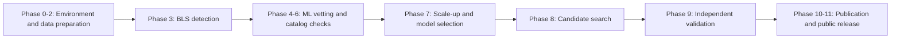

**SXS does not claim the discovery or confirmation of any new exoplanet. Every reported signal is unvalidated and requires independent confirmation.**

# SXS — Reproducible Kepler Transit Detection and Candidate Vetting

[](LICENSE)
[](pyproject.toml)
[](DISCLAIMER.md)

SCIX Exoplanet Search (SXS) is a reproducible computational pipeline combining Box Least Squares (BLS) transit detection, machine-learning ranking, catalog cross-checks, and independent candidate vetting in public Kepler photometry. The initial benchmark measured end-to-end recovery on confirmed systems; the scaled workflow then searched a deterministic sample of 250 targets without cumulative-KOI or confirmed-Kepler-name history. Independent validation of the resulting shortlist found 0 strong candidates, 1 weak candidate, and 19 likely false positives. The project is a methodology and negative-result case study, not a planet-discovery catalog.

No CI badge is shown because a hosted GitHub Actions workflow has not yet been configured. Local verification is documented below.

## Key Results

| Result | Value | Interpretation |
|---|---:|---|
| Internal v1 BLS top-five recovery | 15/36 (41.67%) | Confirmed planets recovered inside the fixed search domain |
| Internal v1 RF end-to-end recovery | 12/36 (33.33%) | Planets retained after BLS proposal and RF vetting |
| Internal v2 BLS top-five recovery | 227/434 (52.30%) | Scaled confirmed-planet benchmark |
| RF v2 precision / recall at review threshold | 0.412 / 0.903 | Target-grouped out-of-fold metrics at threshold 0.221107 |
| RF v2 FPR at review threshold | 0.146 | Derived from 292 false passes among 2,000 negative peaks |
| Phase 8 search | 250 targets; 1,250 peaks | Deterministic workstation-bounded sample |
| Phase 9 outcome | 0 strong; 1 weak; 19 likely FP | Independent vetting of the frozen 20-signal queue |

The sole weak signal is KIC 8300900-r1 at 5.090289 days, with empirical BLS FAP 20/1,001 = 0.01998. It lacks TESS period support and is not a confirmed exoplanet.

## Repository Structure

The tree below reflects the repository's tracked top-level layout. Generated caches and virtual environments are intentionally omitted.

```text
.
├── configs/                     YAML configurations for baseline, scale-up, search, and validation
├── data/
│   ├── catalog/                 Versioned official catalog snapshots and provenance
│   ├── processed/               Compact baseline manifests and derived tables
│   ├── scaleup/                 Phase 7 selections and reproducibility artifacts
│   ├── phase8/                  Unknown-pool selection and frozen shortlist products
│   ├── phase9/                  Independent-vetting tables and final ranking
│   └── raw/                     Local mission-product cache; contents are gitignored
├── models/                      Model-selection metadata; large fitted models are gitignored
├── notebooks/                   Reserved for exploratory notebooks
├── output/pdf/                  Submission-style preprint PDF
├── reports/                     Phase reports, metrics, figures, RNAAS draft, and audits
├── scripts/                     Publication build utilities
├── src/
│   ├── ingest/                  Catalog and MAST acquisition
│   ├── preprocess/              Quality filtering, normalization, and detrending
│   ├── detect/                  BLS transit search
│   ├── model/                   Feature construction and baseline vetters
│   ├── validate/                Catalog association and benchmark reporting
│   ├── scaleup/                 Phase 7 dataset construction and model selection
│   ├── candidate_search/        Phase 8 bounded unknown-target search
│   └── independent_validation/  Phase 9 statistical and astrophysical vetting
└── tests/                       Deterministic unit and integration tests
```

## Installation

SXS is tested with Python 3.11 on Windows. The package metadata supports Python 3.11 and 3.12; Linux and macOS should work for the Python pipeline but have not received the same end-to-end workstation validation.

```powershell
git clone https://github.com/Science-Experimental-Technologies/Exoplanet-Search.git
cd Exoplanet-Search
py -3.11 -m venv .venv
.\.venv\Scripts\Activate.ps1
python -m pip install --upgrade pip
python -m pip install -r requirements.txt
```

On Linux or macOS, activate with `source .venv/bin/activate`.

- `requirements.txt` installs the complete scientific and ML stack, including TensorFlow and MLflow.
- `requirements-core.txt` is the lighter stack for acquisition, preprocessing, BLS, and non-neural work.
- `requirements-ml.txt` is a backward-compatible alias for the full stack.
- `requirements-docs.txt` contains the PDF build and inspection dependencies.

## Usage

The baseline orchestrator exposes the Phase 0–5 CLI:

```powershell
# Inspect the plan without writing artifacts
python -m src.pipeline --config configs/base.yaml --dry-run

# Resume a complete baseline run from accepted artifacts
python -m src.pipeline --config configs/base.yaml --resume

# Run only preprocessing through catalog validation
python -m src.pipeline --config configs/base.yaml --from-phase 2 --to-phase 5 --resume
```

The real dry-run output begins:

```json
{
  "status": "dry_run",
  "options": {
    "from_phase": 0,
    "to_phase": 5,
    "resume": false,
    "dry_run": true
  }
}
```

Scale-up, search, and independent validation use their dedicated entry points:

```powershell
python -m src.scaleup.run_phase7 --config configs/scaleup.yaml --resume
python -m src.candidate_search.run_phase8 --config configs/candidate_search.yaml --resume
python -m src.independent_validation.run_phase9 --config configs/independent_validation.yaml --stage all
```

These commands can download public mission data and perform expensive BLS searches. Review each YAML configuration and the stored run reports before starting a full reproduction.

## Methodology Summary



1. **Phase 0 — Environment:** pin dependencies, seeds, configuration, and artifact conventions.
2. **Phases 1–2 — Data preparation:** acquire Kepler products, filter quality flags, normalize segments, and detrend flux.
3. **Phase 3 — Detection:** search 0.5–50 day periods with BLS and retain five distinct peaks per target.
4. **Phases 4–6 — Baseline validation:** build features, evaluate RF/CNN vetters with target-grouped splits, and cross-check catalogs.
5. **Phase 7 — Scale-up:** expand labeled populations and freeze the RF v2 model-selection policy and review threshold.
6. **Phase 8 — Candidate search:** search a deterministic 250-target sample and freeze a 20-signal review queue.
7. **Phase 9 — Independent validation:** apply empirical FAP, odd/even and secondary tests, physical transit fits, Gaia, TESS, and public TOI evidence without reusing ML scores.
8. **Phases 10–11 — Publication and release:** produce the research report, RNAAS-length draft, reproducibility metadata, and public-release audit.

See the [full research report](reports/research_report.md) for scientific detail and explicit interpretation boundaries.

## Results and Reproducibility

For a baseline reproduction using available cache entries and accepted stage artifacts:

```powershell
python -m src.pipeline --config configs/base.yaml --resume
python -m pytest
```

The live MAST smoke test is intentionally opt-in:

```powershell
$env:SXS_RUN_NETWORK_TESTS = "1"
python -m pytest -m network tests/test_mast_client_network.py
```

Hosted CI runs the deterministic non-network suite on Ubuntu with Python 3.11 and 3.12 using `requirements-core.txt`. Windows remains validated manually, and changes to RF/CNN or MLflow-dependent paths require a local full-stack run with `requirements.txt` before review.

Primary result records:

- [Baseline benchmark report](reports/benchmark_report.md)
- [Phase 7 scale-up report](reports/phase7_scaleup.md)
- [Phase 8 candidate-search report](reports/phase8_candidate_search.md)
- [Phase 9 independent validation](reports/phase9_independent_validation.md)
- [Full research report](reports/research_report.md)
- [RNAAS-length manuscript draft](reports/rnaas_draft.md)

## Data Sources and Attribution

SXS uses public data and services provided by:

- [NASA Exoplanet Archive](https://exoplanetarchive.ipac.caltech.edu/) for `pscomppars`, cumulative KOI, TOI, and Kepler target metadata.
- [MAST](https://archive.stsci.edu/) for Kepler and TESS mission products.
- [ESA Gaia Archive](https://gea.esac.esa.int/archive/) for Gaia DR3 scene information.
- [ExoFOP](https://exofop.ipac.caltech.edu/) as the upstream public follow-up context represented through the archived TOI lookup.
- [Lightkurve](https://lightkurve.github.io/lightkurve/) for mission-product access and time-series handling.
- [Astroquery](https://astroquery.readthedocs.io/) for archive queries.
- [`batman`](https://lkreidberg.github.io/batman/) for limb-darkened transit models.

Archive data remain governed by their providers' policies and citation requirements; see [DISCLAIMER.md](DISCLAIMER.md).

## Limitations

- The benchmark and bounded search do not support occurrence-rate inference.
- RF scores and the manual-review threshold are not calibrated planetary probabilities.
- Empirical shuffle FAP is conditional on the selected preprocessing and null model; it is not a VESPA-style Bayesian false-positive probability.
- Phase 8/9 uses four Kepler products per target, even when additional quarters exist.
- No pixel-level centroid analysis, spectroscopy, or new physical follow-up was performed.
- Catalog absence is not evidence of astrophysical novelty.

The complete limitations are documented in the [research report](reports/research_report.md#6-limitations).

## Roadmap

- **Internal SXS v1, Phases 0–6:** complete — baseline acquisition, transit recovery, ML vetting, and catalog validation.
- **Internal SXS v2, Phases 7–10:** complete — scale-up, bounded candidate search, independent validation, and manuscript preparation.
- **Public release 1.0.0:** repository polish and release audit complete; publication awaits final human review and push.
- **Planned/exploratory SCIX astronomy work:** larger injection-recovery studies, galaxy classification, and transient detection. These are research directions, not promised deliverables or timelines.

## How to Cite

Machine-readable citation metadata is provided in [CITATION.cff](CITATION.cff). A concise software citation is:

> Andrean, R. 2026. *SCIX Exoplanet Search (SXS): Reproducible Kepler Transit Recovery and Independent Vetting*, version 1.0.0. https://github.com/Science-Experimental-Technologies/Exoplanet-Search

When using the underlying data, also cite the relevant archive, mission, and original catalog publications.

## Contributing

Bug reports, research requests, and pull requests are welcome. Read [CONTRIBUTING.md](CONTRIBUTING.md) and follow the [Code of Conduct](CODE_OF_CONDUCT.md) before participating. Scientific-result changes require methodological justification and regenerated evidence artifacts.

## License

Project-authored software and documentation are released under the [MIT License](LICENSE). Upstream astronomy data retain their original terms and attribution requirements.

## Acknowledgments

SXS relies on the NASA Exoplanet Archive, MAST and the Kepler/TESS mission teams, ESA's Gaia mission and DPAC, and ExoFOP. The implementation builds on open-source astronomy and scientific-Python tools including Astropy, Lightkurve, Astroquery, `batman`, NumPy, pandas, SciPy, scikit-learn, TensorFlow, Matplotlib, and MLflow. Their public infrastructure and software make this reproducible study possible.

The project was developed by [Rasya Andrean](https://www.rasyaandrean.my.id/) under [Science Experimental Technologies](https://github.com/Science-Experimental-Technologies). It was independently funded by [Rasya Andrean](https://github.com/RasyaAndrean) and [Urus Foundation](https://github.com/Urus-Foundation).
