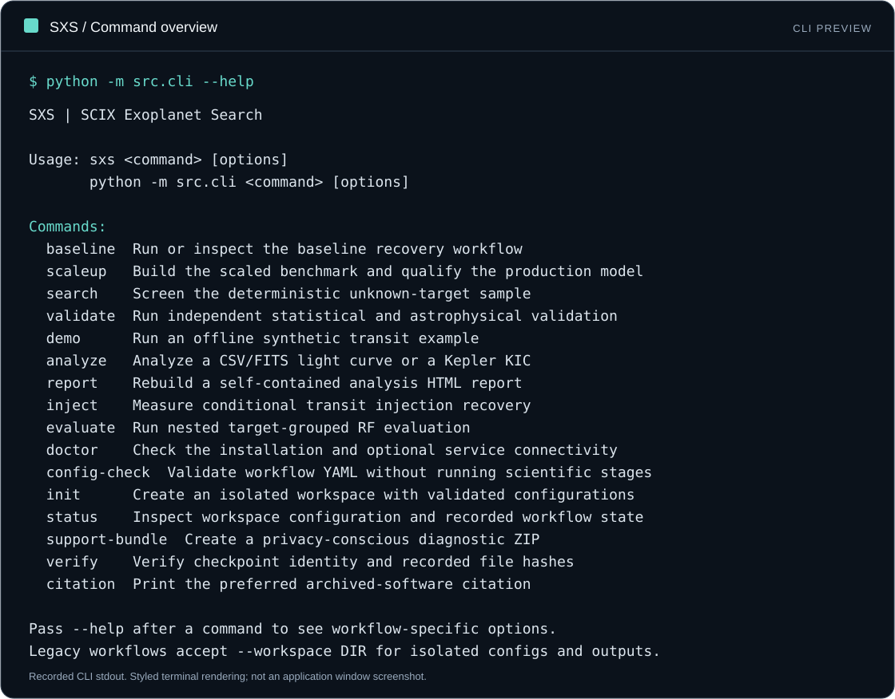
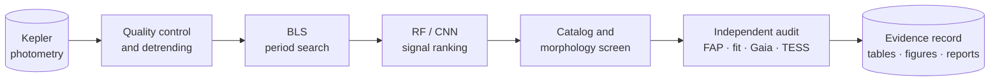

<a id="readme-top"></a>

<p align="center">
  
</p>

<h1 align="center">Exoplanet Search</h1>

<p align="center">
  <strong>A reproducible Kepler transit-recovery, signal-ranking, and independent-vetting pipeline.</strong>
</p>

<p align="center">
  <a href="https://github.com/Science-Experimental-Technologies/Exoplanet-Search/actions/workflows/ci.yml"></a>
  <a href="https://github.com/Science-Experimental-Technologies/Exoplanet-Search/actions/workflows/codeql.yml"></a>
  <a href="https://github.com/Science-Experimental-Technologies/Exoplanet-Search/actions/workflows/public-distribution.yml"></a>
  <a href="https://github.com/Science-Experimental-Technologies/Exoplanet-Search/releases/latest"></a>
  <a href="pyproject.toml"></a>
  <a href="LICENSE"></a>
  <a href="DISCLAIMER.md"></a>
</p>

<p align="center">
  <a href="#abstract">Abstract</a> ·
  <a href="#cli-preview">CLI Preview</a> ·
  <a href="#key-results">Results</a> ·
  <a href="#methodology">Methodology</a> ·
  <a href="#installation">Installation</a> ·
  <a href="#reproduction">Reproduction</a> ·
  <a href="#datasets-and-research-record">Data</a> ·
  <a href="#citation">Citation</a> ·
  <a href="https://science-experimental-technologies.github.io/Exoplanet-Search/">Documentation</a> ·
  <a href="#license-and-commercial-use">License</a>
</p>

> [!IMPORTANT]
> SXS does **not** claim the discovery, validation, or confirmation of a new exoplanet. Model scores prioritize review; they are not planetary probabilities. Every candidate output requires independent scientific confirmation.

## Abstract

SXS is a computational astronomy system for detecting and reviewing transit-like signals in public Kepler photometry. It combines segment-aware light-curve preprocessing, Box Least Squares (BLS) period searches, target-grouped machine learning, catalog screening, empirical false-alarm analysis, physical transit fitting, and external evidence from Gaia and TESS. The research evaluates both end-to-end recovery on confirmed systems and a deterministic candidate search among targets without cataloged KOI or confirmed-name history. Its final independent review produced **0 strong candidates, 1 weak candidate, and 19 likely false positives**—a reproducible methodology and negative-result record, not a planet-discovery claim.

## CLI preview



Recorded CLI output, rendered as a terminal preview—not a graphical application.
See the [preview gallery](https://science-experimental-technologies.github.io/Exoplanet-Search/getting-started/cli-preview/)
for the baseline dry-run view, copyable output, and commands to try locally.

## Key results

| Evaluation | Result | Interpretation |
|---|---:|---|
| Baseline BLS top-five recovery | **15/36 (41.67%)** | Confirmed planets recovered within the fixed search domain |
| Baseline RF end-to-end recovery | **12/36 (33.33%)** | Confirmed planets retained after detection and ranking |
| Scaled BLS top-five recovery | **227/434 (52.30%)** | Recovery on the quality-filtered confirmed-planet benchmark |
| RF v2 precision / recall | **0.412 / 0.903** | Target-grouped out-of-fold metrics at threshold 0.221107 |
| RF v2 false-positive rate | **0.146** | 292 false passes among 2,000 negative peaks |
| Bounded candidate search | **250 targets; 1,250 peaks** | Deterministically selected workstation-scale sample |
| Frozen review queue | **20 signals** | Highest-ranked signals passing preliminary checks |
| Independent review | **0 strong; 1 weak; 19 likely FP** | Final classification using independent evidence rules |

The sole weak signal, `KIC 8300900-r1`, has a period of **5.090289 days** and empirical BLS false-alarm probability **20/1,001 = 0.01998**. It has no supporting TESS period match and is not a confirmed exoplanet.

## Methodology

1. **Acquire** public Kepler light curves and catalog ground truth through MAST and the NASA Exoplanet Archive.
2. **Prepare** each observing segment with quality filtering, normalization, and Savitzky–Golay detrending.
3. **Search** the 0.5–50 day domain with BLS and retain distinct top-ranked periods.
4. **Qualify** Random Forest and compact 1D CNN rankers with `StratifiedGroupKFold`, keeping every target in only one fold.
5. **Screen** a deterministic 250-target sample after excluding cataloged KOI and confirmed-name history.
6. **Audit independently** with segment-shuffle FAP, odd/even and secondary-eclipse tests, limb-darkened transit fits, stellar-radius plausibility, Gaia scene analysis, TESS photometry, and TOI lookup.
7. **Record evidence** as versioned configurations, machine-readable tables, figures, and reports.

Ranking and scientific validation are deliberately separated. The independent audit does not reuse model probabilities in its decision rules.

## Architecture



| Layer | Main implementation | Responsibility |
|---|---|---|
| Acquisition | `src/ingest/` | Mission products and catalog snapshots |
| Signal processing | `src/preprocess/`, `src/detect/` | Cleaning, detrending, and BLS searches |
| Ranking | `src/model/`, `src/scaleup/` | Feature extraction and grouped ML evaluation |
| Scientific review | `src/independent_validation/`, `src/validate/` | Independent tests, catalog checks, and evidence classification |
| Orchestration | `src/cli.py`, `configs/` | Reproducible commands and decision rules |

## Installation

SXS supports Python 3.11 and 3.12. Windows received the full workstation research validation; the CI matrix tests the deterministic core and installed wheel on Ubuntu, Windows, and macOS.

### Platform downloads

| Platform | Release bundle | Installation entry point |
|---|---|---|
| Windows | [Download `.zip`](https://github.com/Science-Experimental-Technologies/Exoplanet-Search/releases/download/v1.3.0/sxs-v1.3.0-windows-python.zip) | `PLATFORM_INSTALL.md` using PowerShell |
| macOS | [Download `.tar.gz`](https://github.com/Science-Experimental-Technologies/Exoplanet-Search/releases/download/v1.3.0/sxs-v1.3.0-macos-python.tar.gz) | `PLATFORM_INSTALL.md` using Terminal |
| Linux | [Download `.tar.gz`](https://github.com/Science-Experimental-Technologies/Exoplanet-Search/releases/download/v1.3.0/sxs-v1.3.0-linux-python.tar.gz) | `PLATFORM_INSTALL.md` using a POSIX shell |

All three bundles contain the same Python source and scientific record. Verify downloads against [`SHA256SUMS.txt`](https://github.com/Science-Experimental-Technologies/Exoplanet-Search/releases/download/v1.3.0/SHA256SUMS.txt).

For CLI use without a checkout, download the [standalone wheel](https://github.com/Science-Experimental-Technologies/Exoplanet-Search/releases/download/v1.3.0/scix_exoplanet_search-1.3.0-py3-none-any.whl), verify its checksum, and install it in a Python virtual environment:

```bash
python -m pip install scix_exoplanet_search-1.3.0-py3-none-any.whl
sxs demo --output demo
```

Open `demo/report.html`. The wheel bundles default configurations, not observations
or trained models. See the [installation guide](docs/getting-started/installation.md).

### Container package (GHCR)

The Python application is packaged as a Linux/amd64 container, including the
complete scientific dependencies. Windows and macOS require a Linux-container
runtime; this is not a native executable for those platforms.

The [GHCR package](https://github.com/Science-Experimental-Technologies/Exoplanet-Search/pkgs/container/exoplanet-search)
is public. Anonymous pull and runtime verification for the numbered release is
performed by the Public distribution workflow; no GitHub login is needed.

```bash
docker pull ghcr.io/science-experimental-technologies/exoplanet-search:v1.3.0
docker run --rm ghcr.io/science-experimental-technologies/exoplanet-search:v1.3.0 --help
```

`v1.3.0` is the numbered container release; `main` follows tested default-branch builds.
See the [container guide](docs/getting-started/container.md) for persistent data,
digest pinning, local builds, and initial package visibility setup. There are no
npm, NuGet, Maven, or RubyGems packages: SXS currently has no SDK in those languages.

### Install from Git

```powershell
git clone https://github.com/Science-Experimental-Technologies/Exoplanet-Search.git
cd Exoplanet-Search
py -3.11 -m venv .venv
.\.venv\Scripts\Activate.ps1
python -m pip install --upgrade pip
python -m pip install -r requirements.txt
```

On Linux or macOS, create the environment with `python3.11 -m venv .venv` and activate it with `source .venv/bin/activate`.

Choose the dependency profile appropriate to the task:

- `requirements-core.txt` — acquisition, preprocessing, BLS, validation, and CI;
- `requirements.txt` — complete scientific and machine-learning environment;
- `requirements-ml.txt` — compatibility alias for the complete environment; and
- `requirements-docs.txt` — documentation website, manuscript, and PDF build support.

## Reproduction

### Try an isolated offline example

Analysis workbench commands included in v1.2.0:

```bash
python -m src.cli demo --output runs/demo
python -m src.cli analyze --input runs/demo/input.csv --time-system relative --output runs/analysis
python -m src.cli inject --periods 3 --depths 0.005 --repeats 5 --output runs/injections
python -m src.cli evaluate --demo --trees 20 --bootstrap 100 --output runs/evaluation
```

Open `runs/demo/report.html` for the offline analysis report. These synthetic
examples do not constitute scientific discoveries or update archived metrics.
The [workbench guide](docs/guides/workbench.md) covers FITS/KIC input, model
compatibility, HTML reports, injection recovery, and nested grouped evaluation.
Output folders must be new. Legacy workflows accept `--workspace DIR` for
separate configs and outputs; their `--resume` now requires content-verified
checkpoints rather than archived reports alone.

### Reproduce the research workflow

The unified interface names workflows by scientific responsibility:

```powershell
# Inspect the baseline workflow without writing artifacts
python -m src.cli baseline --config configs/base.yaml --dry-run

# Execute the baseline (required before scale-up in an empty workspace)
python -m src.cli baseline --config configs/base.yaml

# Reproduce scaled training and model qualification
python -m src.cli scaleup --config configs/scaleup.yaml

# Run the bounded candidate screen
python -m src.cli search --config configs/candidate_search.yaml

# Run the independent evidence audit
python -m src.cli validate --config configs/independent_validation.yaml --stage all
```

Full searches can download public mission products, consume substantial storage, and run expensive period grids. Review the chosen configuration before execution.

Use a separate checkout for a new run: tracked reports are frozen evidence, not
proof that the untracked light curves and model binaries exist. Add `--resume`
only after verifying that those artifacts belong to the same run. See the
[reproducibility guide](docs/project/reproducibility.md).

Verify the deterministic core with:

```powershell
python -m pytest -m "not network"
python -m src.cli baseline --config configs/base.yaml --dry-run
```

The live MAST integration test is opt-in:

```powershell
$env:SXS_RUN_NETWORK_TESTS = "1"
python -m pytest -m network tests/test_mast_client_network.py
```

## Datasets and research record

SXS uses public upstream data but does not relicense or take ownership of it.

| Source | Role in SXS |
|---|---|
| [MAST](https://archive.stsci.edu/) / Kepler | Time-series photometry and product inventory |
| [NASA Exoplanet Archive](https://exoplanetarchive.ipac.caltech.edu/) | Confirmed-planet and KOI false-positive ground truth |
| [Gaia Archive](https://gea.esac.esa.int/archive/) | Nearby-source and stellar-context evidence |
| [TESS](https://archive.stsci.edu/missions-and-data/tess) | Independent photometric comparison where available |
| [ExoFOP](https://exofop.ipac.caltech.edu/) | Public TOI cross-check |

Project-authored evidence is tracked in these records:

- [Complete research report](reports/research_report.md)
- [Baseline benchmark](reports/benchmark_report.md)
- [Scaled model qualification](reports/model_qualification.md)
- [Candidate screening](reports/candidate_screening.md)
- [Independent validation](reports/independent_validation.md)
- [RNAAS-length manuscript draft](reports/rnaas_draft.md)
- [AASTeX RNAAS submission package](manuscript/README.md)
- [Zenodo DOI publication checklist](docs/project/zenodo-doi.md)
- [Documentation and consistency audit](reports/documentation_audit.md)
- [Workbench implementation and verification](reports/workbench_verification.md)
- [Archived research preprint v1.0.0](output/pdf/sxs_preprint_v1.0.0.pdf) — see [publication status and corrections](docs/project/publication.md) before reuse

<details>
<summary><strong>Repository structure</strong></summary>

```text
configs/       Versioned workflow and decision-rule configuration
data/          Catalog snapshots, compact evidence tables, and cache roots
models/        Model-selection metadata; large fitted binaries are untracked
reports/       Scientific reports, metrics, figures, and release audits
scripts/       Publication and artifact utilities
src/           Acquisition, preprocessing, detection, ranking, and validation
tests/         Deterministic unit and integration tests
```

</details>

## Scientific limitations

- The selected benchmarks do not support exoplanet occurrence-rate inference.
- RF and CNN outputs are review-prioritization scores, not calibrated posterior probabilities.
- The empirical shuffle FAP is conditional on the preprocessing, null construction, and search grid; it is not a VESPA-style Bayesian probability.
- The bounded search uses four Kepler products per target even where additional data exist.
- No new spectroscopy, high-resolution imaging, or pixel-level physical follow-up was performed.
- Catalog absence does not establish astrophysical novelty.

Read [DISCLAIMER.md](DISCLAIMER.md) before interpreting or redistributing candidate results.

## Citation

If SXS materially supports your research or technical work, cite the release metadata in [CITATION.cff](CITATION.cff):

```text
Andrean, R. (2026). SCIX Exoplanet Search (SXS): Reproducible Kepler
Transit Recovery and Independent Vetting (Version 1.3.0).
Science Experimental Technologies.
https://github.com/Science-Experimental-Technologies/Exoplanet-Search
```

Also cite the relevant mission archives, catalogs, and scientific software—including [Lightkurve](https://lightkurve.github.io/lightkurve/), [Astroquery](https://astroquery.readthedocs.io/), and [`batman`](https://lkreidberg.github.io/batman/)—when their data or methods are used.

## Creator, affiliation, and funding

SXS was created and developed by **Rasya Andrean** under **[Science Experimental Technologies](https://github.com/Science-Experimental-Technologies)**. Visit the [project website](https://science-experimental-technologies.github.io/Exoplanet-Search/) for documentation.

The project was independently funded by **[Rasya Andrean](https://github.com/RasyaAndrean)** and **[Urus Foundation](https://github.com/Urus-Foundation)**.

For research collaboration, commercial licensing, or royalty administration, contact `scix.official@gmail.com`.

## Contributing

Focused bug reports, reproducibility improvements, and scientifically justified pull requests are welcome. Read [CONTRIBUTING.md](CONTRIBUTING.md) and the [Code of Conduct](CODE_OF_CONDUCT.md) before contributing. Contributions retain their repository-recorded credit but do not remove the original creator attribution or alter the project license.

New users can follow the [independent testing protocol](docs/project/user-testing.md)
and report installation or usability problems through the dedicated issue template.

## License and commercial use

Current revisions are distributed under the [SXS Source-Available Commercial License 1.0](LICENSE). This is a source-available license, **not** an OSI-approved open-source license.

- Public projects, deployments, and outputs materially using SXS must credit **Rasya Andrean** and **Science Experimental Technologies**.
- Academic and technical publications must use the release citation in [CITATION.cff](CITATION.cff).
- Commercial use requires registration, quarterly reporting, and a **10% royalty on Covered Revenue**, unless a separate signed agreement applies.
- Award or competition submissions materially enabled by SXS must provide the required acknowledgment where applicable rules permit.

See [COMMERCIAL_USE.md](COMMERCIAL_USE.md) for the practical process and [NOTICE](NOTICE) for the required attribution. The full [LICENSE](LICENSE) controls if any summary differs.

The tagged `v1.0.0` release was previously distributed under MIT. Rights already granted with copies of that release are not retroactively withdrawn; the current license governs revisions carrying it. Obtain qualified legal review before relying on custom license terms for material commercial activity.

<p align="right">(<a href="#readme-top">back to top</a>)</p>
