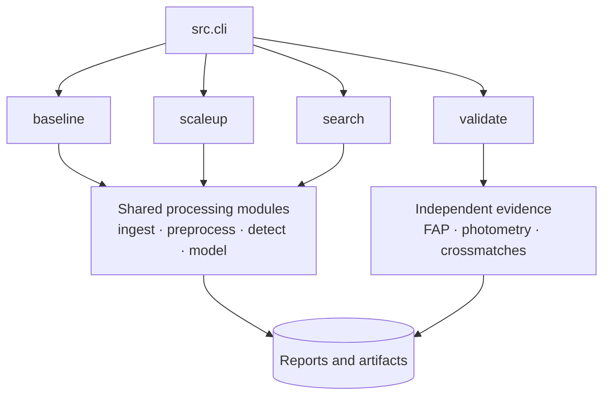

# Architecture

SXS is organized by scientific responsibility. Command orchestration is thin;
domain modules create machine-readable artifacts and reports that can be
audited independently.

## Module boundaries

| Package | Responsibility |
|---|---|
| `src.ingest` | Catalog access, MAST acquisition, manifests, positive/negative datasets |
| `src.preprocess` | FITS extraction, quality filtering, interpolation flags, detrending |
| `src.detect` | Period grid, BLS evaluation, distinct peaks, recovery metrics |
| `src.model` | Feature/folded-view construction and baseline RF/CNN evaluation |
| `src.scaleup` | Scaled target selection, acquisition, training, and frozen model policy |
| `src.candidate_search` | Unknown pool, deterministic sample, model scoring, shortlist |
| `src.independent_validation` | FAP, physical vetting, external crossmatches, classification |
| `src.validate` | Baseline catalog checking and benchmark reporting |

## Four public workflows

### Baseline

A six-stage resumable orchestration: environment, acquisition, preprocessing,
BLS detection, machine learning, and catalog validation.

### Scale-up

Builds a larger quality-filtered benchmark, trains RF v2/CNN v2, applies the
prespecified selection policy, and writes the production model selection
metadata. It does not run candidate screening.

### Search

Builds the eligible unknown pool, selects targets deterministically, processes
four products per target, scores five BLS peaks per target, and freezes the
top-20 queue after preliminary checks.

### Validate

Consumes the frozen queue and processed light curves. It runs the independent
FAP, photometric, physical, and external-evidence stages before finalizing
categories.

## Design invariants

- configurations are versioned;
- target identities group cross-validation splits;
- raw mission inputs are cached rather than rewritten;
- expensive workflows support resumption where safe;
- accepted stages have explicit artifact contracts;
- ranking is separate from validation;
- candidate labels include an unconfirmed warning; and
- structured run records preserve status and provenance.
