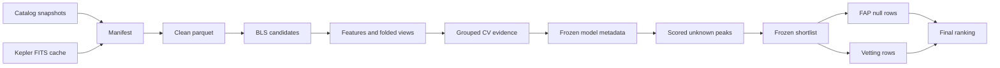

# Data Pipeline

## Data flow

## Storage classes

| Class | Typical location | Repository policy |
|---|---|---|
| Raw mission products | `data/raw/` | Local cache; generally ignored by Git |
| Catalog snapshots | `data/catalog/`, `data/scaleup/catalog/` | Compact accepted snapshots may be tracked |
| Processed light curves | `data/*/processed/` | Large target files ignored; compact summaries tracked |
| Candidate tables | `data/processed/`, `data/search/processed/` | Accepted compact evidence selectively tracked |
| Validation evidence | `data/validation/` | Final compact tables and provenance tracked; caches ignored |
| Model binaries | `models/` | Large RF/CNN artifacts ignored; selection metadata tracked |
| Reports and figures | `reports/` | Accepted public evidence tracked |

## Provenance chain

An accepted result should be traceable through:

1. Git commit and software version;
2. YAML configuration path;
3. catalog query metadata and retrieval time;
4. mission-product manifest;
5. preprocessing and BLS summaries;
6. grouped evaluation or model-selection record;
7. search/validation run record; and
8. report, table, and figure paths.

The independent audit additionally records the frozen shortlist SHA-256 so the
review population cannot be silently replaced.

## Resumption

Baseline and scale-up workflows check minimum acceptance artifacts before
skipping completed work. Candidate search also supports `--resume`. Resumption
is a resource-control feature, not permission to mix incompatible artifacts.
The configuration, model selection, and prerequisite files must still match the
intended run.

Independent validation exposes explicit stages rather than a generic resume
flag. Each stage consumes the prior accepted artifact set.

## External-state changes

Live reruns can differ because archive availability, catalog tables, remote
service responses, or software dependencies evolve. To reproduce the published
claim, start from the versioned artifacts. To reproduce the computational
process against current services, preserve the new retrieval metadata and
describe the result as a contemporary rerun.
