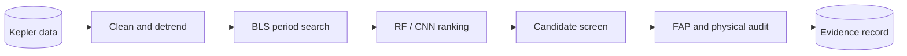

# SCIX Exoplanet Search

**A reproducible Kepler transit-recovery, signal-ranking, and independent-vetting pipeline.**

[Install SXS](getting-started/installation.md){ .md-button .md-button--primary }
[Reproduce the research](getting-started/quickstart.md){ .md-button }
[Read the results](research/results.md){ .md-button }

!!! important "Scientific status"
    SXS reports **no confirmed exoplanet discovery**. Its independent review found
    0 strong candidates, 1 weak candidate, and 19 likely false positives. Model
    scores prioritize review; they are not planetary probabilities.

## What SXS does

SXS turns public mission data into an auditable evidence record. It acquires
Kepler products and official catalog snapshots, cleans and detrends light
curves, searches for periodic transit-like signals with Box Least Squares
(BLS), ranks signals with target-grouped machine learning, and then performs an
independent statistical and astrophysical audit.

## Documentation map

| If you want to... | Start here |
|---|---|
| Install and run a safe smoke test | [Installation](getting-started/installation.md) |
| Understand the complete research design | [Methodology](research/methodology.md) |
| Learn how data move through the system | [Data pipeline](concepts/data-pipeline.md) |
| Run one or all workflows | [Basic usage](guides/basic-usage.md) |
| Resume, isolate, or inspect expensive stages | [Advanced usage](guides/advanced-usage.md) |
| Understand candidate categories and FAP | [Interpreting results](guides/interpreting-results.md) |
| Look up every command and option | [CLI reference](reference/cli.md) |
| Find generated files and provenance records | [Artifact reference](reference/artifacts.md) |
| Cite or reuse the project | [Citation](project/citation.md) and [license](project/license-security.md) |

## Verified research record

| Evaluation | Result |
|---|---:|
| Baseline BLS top-five recovery | 15/36 (41.67%) |
| Baseline RF end-to-end recovery | 12/36 (33.33%) |
| Scaled BLS top-five recovery | 227/434 (52.30%) |
| RF v2 precision / recall | 0.412 / 0.903 at threshold 0.221107 |
| Bounded search | 250 targets; 1,250 BLS peaks |
| Independent review | 0 strong; 1 weak; 19 likely false positives |

The weak signal is `KIC 8300900-r1` at 5.090289 days, with empirical
FAP `20/1,001 = 0.01998`. It has no supporting TESS period match and remains
unconfirmed.

## Project identity

SXS was created by [Rasya Andrean](https://www.rasyaandrean.my.id/) under
[Science Experimental Technologies](https://github.com/Science-Experimental-Technologies).
It was independently funded by Rasya Andrean and
[Urus Foundation](https://github.com/Urus-Foundation).

Current revisions use the SXS Source-Available Commercial License 1.0. Review
the [license and commercial-use terms](project/license-security.md) before
redistribution or commercial use.
