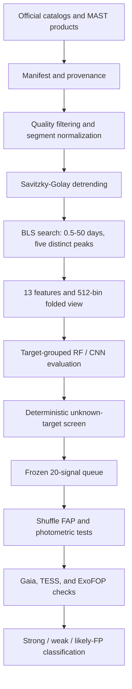

# Methodology

## End-to-end design



## Acquisition and provenance

Confirmed transiting parameters are retrieved from `pscomppars`. Official
negative labels come from cumulative KOI records. Kepler long-cadence FITS
products are queried through MAST and cached as immutable inputs. Catalog
snapshots record query text, retrieval time, source URL, and artifact metadata.

## Cleaning and detrending

For each product, SXS:

1. keeps finite time and flux samples passing the configured Kepler quality
   bitmask;
2. applies asymmetric sigma clipping;
3. normalizes observing segments independently;
4. interpolates only gaps no larger than the configured cadence limit, marking
   every interpolated row;
5. applies iterative Savitzky-Golay flattening; and
6. excludes interpolated samples from detection and feature statistics unless
   a configuration explicitly states otherwise.

The default window is 401 long-cadence samples, about 8.2 days, above the
maximum searched transit duration of 12 hours.

## BLS detection

The configured search domain is 0.5–50 days with requested durations of 1, 2,
4, 8, and 12 hours. The implementation requires durations to be strictly shorter
than the minimum period, so the 12-hour entry is excluded at the supplied
0.5-day lower bound; diagnostics record the actual durations used. The fast BLS
implementation optimizes S/N over an oversampled period
grid. It retains five peaks separated by at least 1% in period. Recovery
requires the recovered and catalog periods to agree within 1% in the exact
metric; harmonic diagnostics are recorded separately.

## Candidate representation

Each peak receives 13 scalar features:

- period, duration, depth, depth uncertainty, S/N, and BLS power;
- duty cycle;
- odd/even mismatch;
- secondary depth and secondary-to-primary ratio;
- robust scatter;
- transit count; and
- number of primary-transit samples.

The CNN receives a robustly normalized, phase-binned global view with 512 bins.

## Grouped model qualification

Five-fold `StratifiedGroupKFold` evaluation groups all rows by target identifier.
Signals from one star cannot appear in both train and evaluation partitions.
The scale-up review threshold maximizes precision subject to recall of at least
0.90. CNN replaces RF only if it improves precision by at least 0.02 and has
fold-F1 standard deviation no greater than 0.10. This policy selected RF v2.

## Candidate screening

The unknown pool requires `object_status=0`, Kepler magnitude 10–15, and at
least eight available quarters. Any KIC appearing in the cumulative KOI table
or confirmed Kepler-name table is removed. From 100,347 eligible targets, 250
are selected by ascending SHA-256 of a fixed seed and KIC. Sampling does not use
flux, BLS, or model score.

Four products per selected target are processed. RF v2 scores all five BLS
peaks. Preliminary odd/even, phase-0.5 secondary, and available moment-centroid
checks reduce the review population; the highest-ranked 20 become a frozen
independent-validation queue.

## Independent validation

For each unique target, 1,000 segment-wise circular-shuffle BLS searches create
a target-level null distribution. The empirical FAP uses a plus-one correction:

```text
FAP = (k + 1) / (N + 1)
```

where `k` null maxima equal or exceed the observed power and `N = 1,000`.
Additional tests measure odd/even depth consistency, secondary eclipses,
limb-darkened transit shape, companion-radius plausibility, Gaia neighbors,
TESS period support, and public TOI history.

A key failure forces `likely_false_positive`. A `strong_candidate` requires
FAP no greater than 0.01, every internal test passing, a clean available Gaia
scene, and TESS period support. A row without a key failure but lacking that
complete evidence is `weak_candidate`. None of these categories confirms a
planet.
