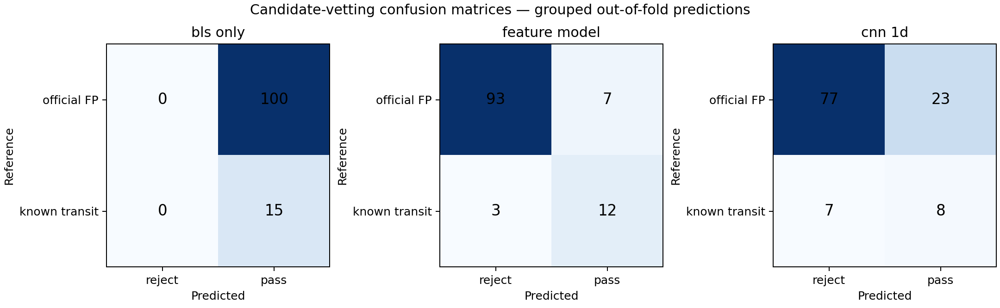

# SXS v1 Benchmark Report

## Executive result

BLS recovered **15 of 36 eligible confirmed planets (41.67%)** in the fixed 0.5–50 day domain. Applying the leakage-safe feature model retained 12 planets (33.33% end-to-end recall) while reducing candidate-level false-positive rate from 100% to 7%. The CNN retained 8 planets (22.22%) with a 23% false-positive rate.

| Stage | Candidate precision | Candidate recall | Candidate FPR | Candidate F1 | End-to-end recall |
|---|---:|---:|---:|---:|---:|
| bls_only | 0.130 | 1.000 | 1.000 | 0.231 | 0.417 |
| feature_model | 0.632 | 0.800 | 0.070 | 0.706 | 0.333 |
| cnn_1d | 0.258 | 0.533 | 0.230 | 0.348 | 0.222 |

## Evaluation contract

- Detection recall denominator: 36 confirmed planets whose official periods fall within the configured BLS domain. Eleven longer-period planets are excluded before scoring.
- A BLS recovery requires a top-five period within ±1% of the official period; harmonic matches are not counted in the primary metric.
- Vetting positives: the 15 exact BLS recoveries. Vetting negatives: 100 BLS candidates from 20 official Kepler `FALSE POSITIVE` systems.
- Feature and CNN decisions use five-fold out-of-fold probabilities grouped by target. No final-model training prediction is used in benchmark metrics.
- Candidate FPR uses negative candidates as units. End-to-end recall uses confirmed planets as units; these denominators are intentionally reported separately.

## Catalog cross-check

Every operational candidate is checked against the local provenance-bearing NASA Exoplanet Archive snapshot by configured host and ±1% period. Matches are `recovered_known`; targets drawn from the official false-positive sample remain `official_false_positive_system`; other unmatched signals are `unvalidated_candidate_requires_independent_confirmation`.

Operational probabilities in `catalog_checked_candidates.parquet` come from final models fitted on the complete model-benchmark dataset and are intended for pipeline execution only. They are not used for the benchmark table above.

## Interpretation

The feature model supplies the strongest current trade-off: precision rises from 0.130 to 0.632 and FPR falls to 0.070, at the cost of rejecting three of the 15 detected planets. Because ML cannot recover planets BLS never proposed, overall recall falls from 0.417 to 0.333.

The CNN is not competitive at this sample size. Its fold variance and weaker fixed-threshold precision indicate that a larger, consistently quarter-matched training set and nested validation are required before it should gate candidates.

## Limitations

This benchmark is small and Kepler-specific. Five candidates from each false-positive system create correlated rows, although group-wise splitting prevents leakage. Positive and negative quarter coverage differs, thresholds are not independently calibrated, and catalog non-matches are not scientific discoveries. Any unmatched output requires independent pixel-level vetting, centroid analysis, and external confirmation.

## Official data sources

- NASA Exoplanet Archive TAP service: https://exoplanetarchive.ipac.caltech.edu/TAP/sync
- Kepler KOI cumulative-table column definitions: https://exoplanetarchive.ipac.caltech.edu/docs/API_kepcandidate_columns.html
- MAST Kepler light curves accessed through Lightkurve.
