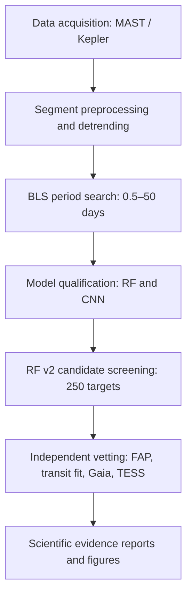
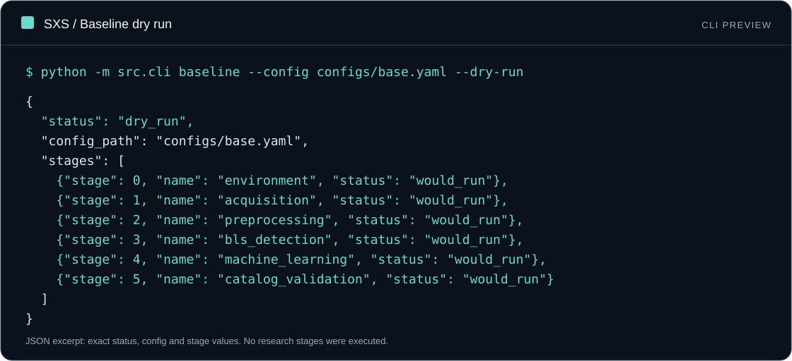
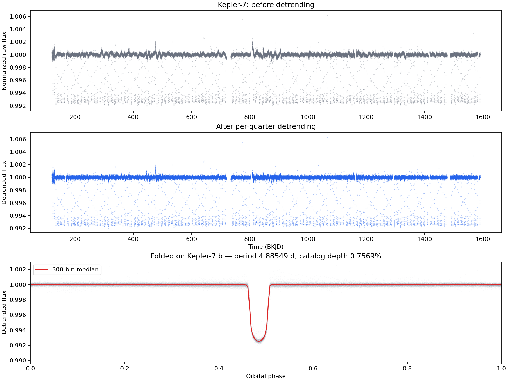
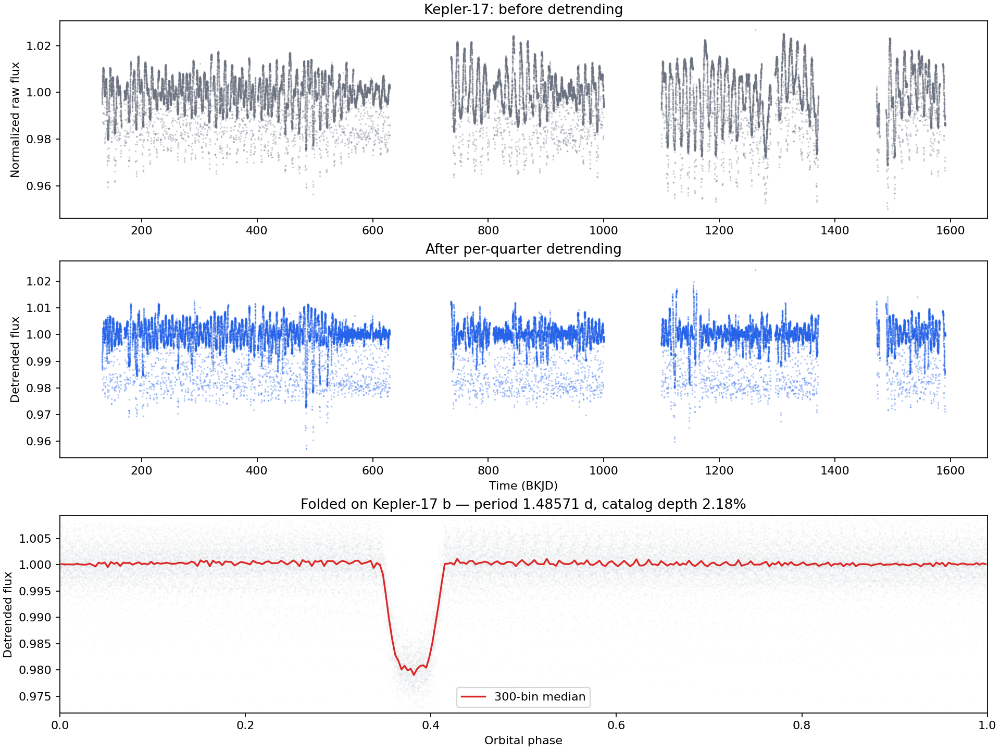
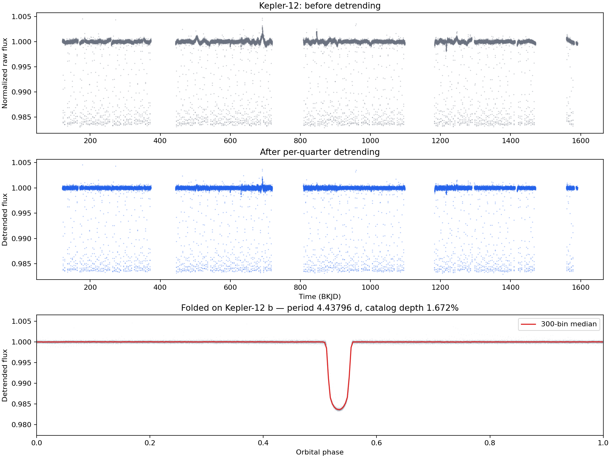
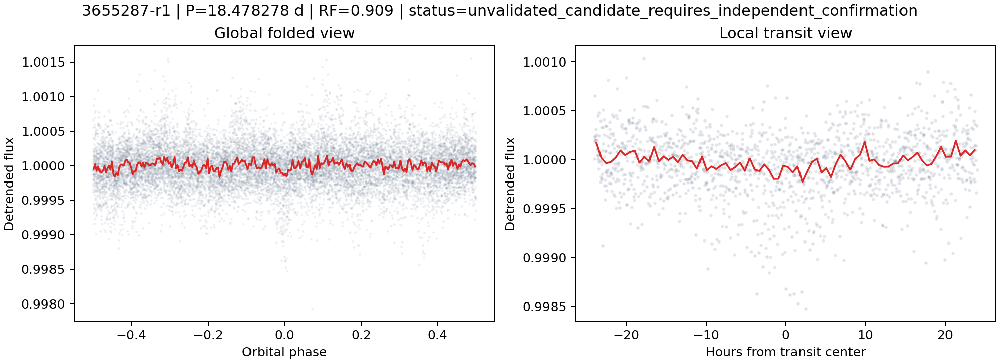
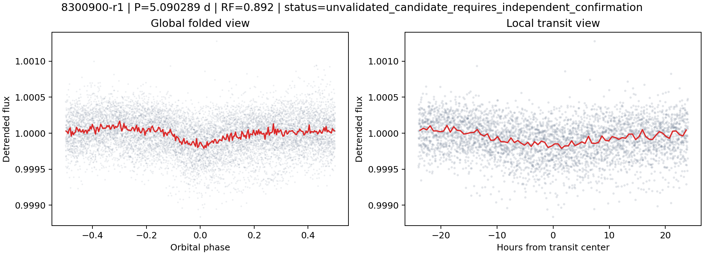

# Exoplanet Search — Execution and Visual Walkthrough

Exoplanet Search (SXS) is a computational astronomy pipeline for detecting,
ranking, and independently vetting transit-like signals in public Kepler
photometry. It does not confirm new exoplanets.

This walkthrough separates safe CLI inspection, deterministic software tests,
and archived research figures. Tests and a dry run are **not** a new end-to-end
scientific reproduction. Tests can write temporary files and caches; only the
baseline dry-run command below promises not to execute research stages.

## 1. Architecture and workflow

The diagram shows six processing responsibilities followed by evidence reporting.
These are not the same as the six numbered stages of the baseline-only CLI.



## 2. Deterministic software tests

From an activated scientific Python environment in the repository root:

```bash
python -m pytest -m "not network"
```

The earlier walkthrough recorded 42 passing tests and one skipped live MAST
test on Python 3.11.9. That is a historical snapshot, not a fixed acceptance
count: additional regression tests change the current total. The command above
deselects network tests; plain `python -m pytest` skips the opt-in MAST test
unless `SXS_RUN_NETWORK_TESTS=1` is set. This variable is an opt-in flag, not an
authentication token.

The tests cover contracts and representative fixtures for acquisition,
preprocessing, BLS, features, orchestration, and independent vetting. Passing
them does not establish exhaustive coverage or astrophysical confirmation.

## 3. Command-line interface

### Command overview

```bash
python -m src.cli --help
```


SXS exposes `baseline`, `scaleup`, `search`, and `validate`. Add `--help`
after a command to inspect its arguments.

### Baseline dry run

```bash
python -m src.cli baseline --config configs/base.yaml --dry-run
```



The JSON status is `dry_run`, and the six baseline stages are marked
`would_run`: environment, acquisition, preprocessing, BLS detection, machine
learning, and catalog validation. Those labels describe a plan, not completed
work. The [CLI gallery](docs/getting-started/cli-preview.md) provides copyable
transcripts and explains the timestamps omitted from the preview.

## 4. Archived research figures

These are figures from the recorded analysis, not screenshots of a newly
executed pipeline.

### Project banner


### Light curves before and after preprocessing

Quality filtering, segment normalization, and Savitzky-Golay detrending reduce
some variability but can also distort transit signals. The examples below
illustrate the archived processing; they do not guarantee unbiased recovery.

#### Kepler-7



#### Kepler-17



#### Kepler-12



### Baseline model confusion matrices

These are **baseline v1**, not scaled RF v2/CNN v2, confusion matrices.
They use target-grouped out-of-fold predictions on the baseline candidate set.
See [baseline benchmark metrics](reports/benchmark_report.md).


### Candidate folded views

The ranks in these filenames are the original screening ranks, not the final
independent-validation ranks.

#### Screening rank 1: KIC 3655287-r1

This high-ranked screening signal was later classified as
`likely_false_positive`; a high RF score does not establish planetary nature.



#### Screening rank 5: KIC 8300900-r1

This is the sole `weak_candidate` and rank 1 in the independent-validation
ranking. Its empirical FAP is 0.01998, and there is no supporting TESS period
match. It remains unconfirmed.



## 5. Research summary

| Quantity | Recorded result | Interpretation |
|---|---|---|
| Selected model | RF v2, `models/rf_v2.joblib` | Fitted binary is not distributed in the current source bundles/container |
| Review operating point | Threshold 0.221107; recall 0.903 | Candidate-level out-of-fold recall, not end-to-end recovery or planet probability |
| Bounded search | 250 catalog-filtered targets; 1,250 BLS peaks | No selected KOI/confirmed-name history at the recorded query time |
| Frozen shortlist | 20 signals on 14 unique targets | Input to independent vetting |
| Final categories | 0 strong; 1 weak; 19 likely false positives | No confirmed exoplanet discovery |
| Weak signal | KIC 8300900-r1; 5.090289 days; FAP 0.01998 | Requires evidence beyond this pipeline |

Use the [research report](reports/research_report.md), the
[independent-validation report](reports/independent_validation.md), and the
[publication-status record](docs/project/publication.md) for the scientific
context and archival corrections.
